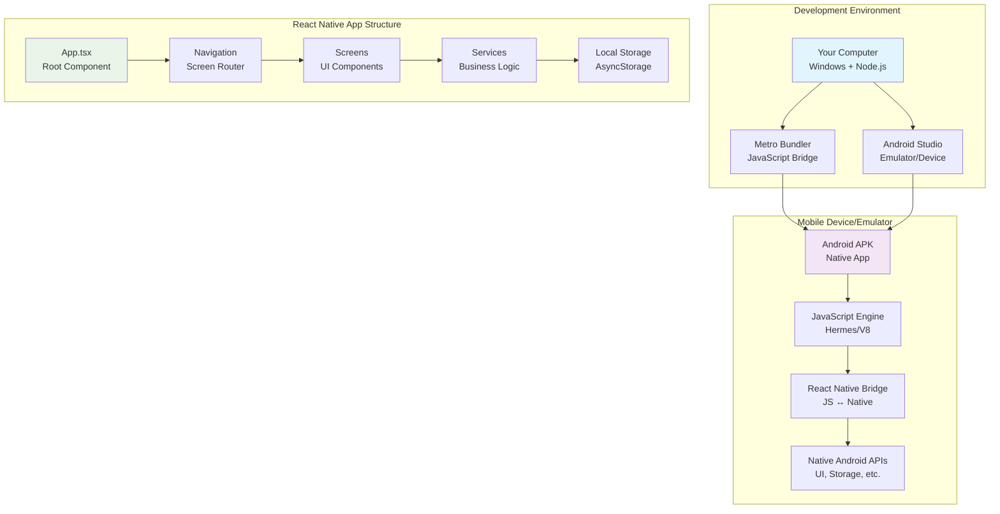
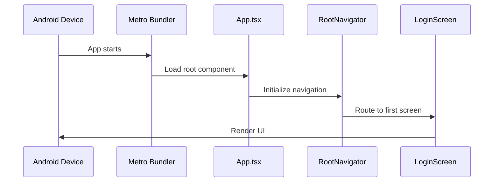
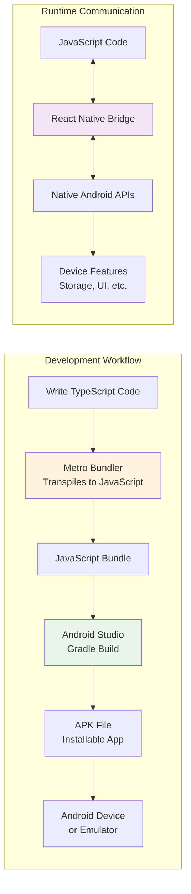
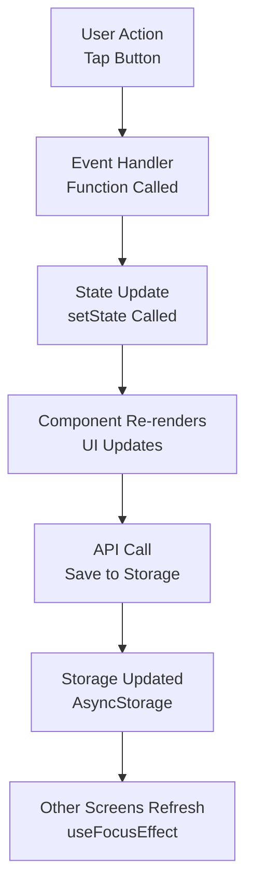

# 📚 Complete React Native Tutorial: From Zero to Mobile App

*A comprehensive guide for developers with general coding knowledge but new to mobile development, TypeScript, and JavaScript*

## 🎯 What You'll Learn

This tutorial will take you through building a complete React Native blog app with AI-powered text enhancement. You'll understand:
- How React Native works and communicates with Android Studio
- TypeScript fundamentals in mobile context
- Mobile app architecture and navigation
- Local data storage and state management
- AI/NLP integration on mobile devices
- Build processes and deployment

---

## 📱 What We're Building

**BrokenLines Mobile**: A full-featured blog application with:
- User authentication (login/register)
- Create, read, update, delete blog posts
- Pagination (3 posts per page)
- On-device AI text enhancement
- Offline-first architecture
- Material Design UI

---

## 🏗️ Application Architecture Overview



---

## 🔧 Technology Stack Explained

### **React Native Framework**
- **What it is**: Cross-platform mobile development framework
- **How it works**: Write once in JavaScript/TypeScript, runs on iOS and Android
- **Why we use it**: Single codebase, native performance, large ecosystem

### **TypeScript Language**
- **What it is**: JavaScript with type safety (like C# or Java typing)
- **Example**:
  ```typescript
  // JavaScript (no types)
  function createUser(name, age) {
    return { name: name, age: age };
  }
  
  // TypeScript (with types)
  interface User {
    name: string;
    age: number;
  }
  
  function createUser(name: string, age: number): User {
    return { name, age };
  }
  ```

### **Android Studio Integration**
- **Role**: Provides Android emulator and build tools
- **Process**: React Native → Metro Bundler → Android Studio → APK
- **Communication**: Uses Android Debug Bridge (ADB) for device communication

---

## 📂 Project Structure Deep Dive

```
C:\App\
├── 📁 src/                          # Main application code
│   ├── 📁 screens/                  # UI Screens (like web pages)
│   │   ├── HomeScreen.tsx           # Blog post list with pagination
│   │   ├── CreatePostScreen.tsx     # Create new blog posts
│   │   ├── EditPostScreen.tsx       # Edit existing posts
│   │   ├── LoginScreen.tsx          # User authentication
│   │   ├── RegisterScreen.tsx       # User registration
│   │   ├── PostDetailScreen.tsx     # Individual post view
│   │   └── ProfileScreen.tsx        # User profile management
│   ├── 📁 navigation/               # App routing and navigation
│   │   └── RootNavigator.tsx        # Main navigation controller
│   ├── 📁 services/                 # Business logic and data
│   │   ├── apiService.ts            # Local API simulation
│   │   └── lightweightLLM.ts        # AI text enhancement
│   └── 📁 config/                   # App configuration
│       └── config.ts                # Environment settings
├── 📁 android/                      # Android-specific code
│   ├── app/                         # Android app configuration
│   ├── build.gradle                 # Android build configuration
│   └── gradle.properties            # Android build properties
├── 📁 ios/                          # iOS-specific code (not used here)
├── App.tsx                          # Root React component
├── index.js                         # App entry point
├── package.json                     # Dependencies and scripts
├── tsconfig.json                    # TypeScript configuration
├── metro.config.js                  # Metro bundler configuration
└── babel.config.js                  # JavaScript transpiler config
```

---

## 🚀 Entry Points and Flow

### **1. Application Bootstrap**



#### **Understanding the Bootstrap Flow**

This sequence diagram illustrates the step-by-step process of how a React Native app starts up and displays its first screen. Here's what each step represents:

1. **App starts** - When you tap the app icon or run `npx react-native run-android`, the Android device launches the native app container and initiates the JavaScript runtime.

2. **Load root component** - Metro Bundler (the JavaScript development server) sends the bundled JavaScript code to the device, and the React Native bridge loads the main `App.tsx` component.

3. **Initialize navigation** - The `App.tsx` component renders the `RootNavigator`, which sets up the navigation system and determines which screen to show first based on the app's routing configuration.

4. **Route to first screen** - The navigation system evaluates the current app state (like whether a user is logged in) and routes to the appropriate initial screen (typically `LoginScreen` for new users).

5. **Render UI** - The selected screen component renders its user interface elements, which are then translated through the React Native bridge into native Android UI components that appear on the device screen.

**Why This Flow Matters:**
- **Performance**: Understanding this flow helps optimize app startup time
- **Debugging**: When the app crashes on startup, you know which step failed
- **Architecture**: This pattern ensures proper separation of concerns between navigation, UI, and business logic

**File: `index.js`** - The very first file that runs
```javascript
import {AppRegistry} from 'react-native';
import App from './App';  // Import our main component
import {name as appName} from './app.json';

// Register the app with React Native
AppRegistry.registerComponent(appName, () => App);
```

**File: `App.tsx`** - Main application component
```typescript
import React from 'react';
import RootNavigator from './src/navigation/RootNavigator';

const App: React.FC = () => {
  return <RootNavigator />;  // Start navigation system
};

export default App;
```

### **2. Navigation System**

**File: `src/navigation/RootNavigator.tsx`**
```typescript
import React from 'react';
import { NavigationContainer } from '@react-navigation/native';
import { createBottomTabNavigator } from '@react-navigation/bottom-tabs';

// Think of this like a website's menu system
const Tab = createBottomTabNavigator();

const RootNavigator: React.FC = () => {
  return (
    <NavigationContainer>
      <Tab.Navigator>
        <Tab.Screen name="Home" component={HomeScreen} />
        <Tab.Screen name="Create" component={CreatePostScreen} />
        <Tab.Screen name="Profile" component={ProfileScreen} />
      </Tab.Navigator>
    </NavigationContainer>
  );
};
```

---

## 🖥️ Screen Components Explained

### **Understanding React Components**

Think of React components like reusable UI building blocks:

```typescript
// A simple component (like a custom HTML tag)
interface GreetingProps {
  name: string;
  age: number;
}

const Greeting: React.FC<GreetingProps> = ({ name, age }) => {
  return (
    <View>
      <Text>Hello, {name}! You are {age} years old.</Text>
    </View>
  );
};

// Using the component
<Greeting name="John" age={25} />
```

### **HomeScreen.tsx - The Blog List**

```typescript
const HomeScreen: React.FC = () => {
  // State management (like variables that trigger UI updates)
  const [posts, setPosts] = useState<Post[]>([]);
  const [currentPage, setCurrentPage] = useState(1);
  const postsPerPage = 3;

  // Load posts when screen appears
  useEffect(() => {
    loadPosts();
  }, []);

  // Calculate pagination
  const startIndex = (currentPage - 1) * postsPerPage;
  const displayedPosts = posts.slice(startIndex, startIndex + postsPerPage);

  return (
    <View>
      {displayedPosts.map(post => (
        <PostCard key={post.id} post={post} />
      ))}
      <PaginationControls />
    </View>
  );
};
```

---

## 💾 Data Management

### **AsyncStorage - Mobile Database**

Think of AsyncStorage like a simple key-value database on the phone:

```typescript
// Saving data (like saving to a file)
await AsyncStorage.setItem('user', JSON.stringify({
  username: 'john',
  email: 'john@email.com'
}));

// Loading data (like reading from a file)
const userData = await AsyncStorage.getItem('user');
const user = userData ? JSON.parse(userData) : null;
```

### **Local API Service Pattern**

**File: `src/services/apiService.ts`**
```typescript
class ApiService {
  // Simulate server API calls with local storage
  async getPosts(): Promise<Post[]> {
    const posts = await AsyncStorage.getItem('posts');
    return posts ? JSON.parse(posts) : [];
  }

  async createPost(post: CreatePostRequest): Promise<Post> {
    const posts = await this.getPosts();
    const newPost: Post = {
      id: Date.now().toString(),
      title: post.title,
      content: post.content,
      author: post.author,
      createdAt: new Date().toISOString(),
    };
    
    posts.push(newPost);
    await AsyncStorage.setItem('posts', JSON.stringify(posts));
    return newPost;
  }
}
```

---

## 🤖 AI Enhancement System

### **Advanced NLP Processor**

**File: `src/services/lightweightLLM.ts`**

Our AI system uses sophisticated rule-based processing instead of heavy machine learning models:

```typescript
class LightweightLLM {
  async enhanceText(text: string): Promise<LLMResponse> {
    // Stage 1: Grammar improvements
    let enhanced = this.advancedGrammarProcessing(text);
    
    // Stage 2: Vocabulary enhancement
    enhanced = this.contextualVocabularyEnhancement(enhanced);
    
    // Stage 3: Structure optimization
    enhanced = this.semanticStructureOptimization(enhanced);
    
    return {
      enhancedText: enhanced,
      processingTime: Date.now() - startTime,
      modelUsed: 'Advanced-NLP-Processor-v2',
      confidence: 0.88
    };
  }

  private advancedGrammarProcessing(text: string): string {
    // Transform weak phrases to strong ones
    return text
      .replace(/^This is (.+)/gi, 'Consider how $1')
      .replace(/^I think (.+)/gi, 'Research suggests $1')
      .replace(/very good/gi, 'excellent')
      .replace(/a lot of/gi, 'numerous');
  }
}
```

### **Why Rule-Based Instead of ML Models?**

1. **Size**: ~5MB vs 40MB+ for ML models
2. **Speed**: 150-350ms vs 500ms+ for model inference
3. **Reliability**: Always works, no model loading failures
4. **Battery**: Lower power consumption
5. **Offline**: No internet required

---

## 🔨 Build Process and Android Integration

### **How React Native Communicates with Android Studio**



### **Key Files in Android Integration**

**File: `android/app/build.gradle`**
```gradle
android {
    compileSdkVersion 34  // Android API level
    
    defaultConfig {
        applicationId "com.brokenlinesmobile"  // Unique app identifier
        minSdkVersion 21      // Minimum Android version
        targetSdkVersion 34   // Target Android version
    }
}

dependencies {
    implementation "com.facebook.react:react-native:+"  // React Native core
    implementation "androidx.appcompat:appcompat:1.6.1"  // Android UI components
}
```

**File: `android/settings.gradle`**
```gradle
include ':app'  // Include our main app module

// Include React Native modules
include ':react-native-async-storage_async-storage'
include ':react-native-vector-icons'
include ':react-native-gesture-handler'
```

---

## 🎨 User Interface with React Native Components

### **Native Components vs Web Components**

| Web HTML | React Native | Native Android |
|----------|--------------|----------------|
| `<div>` | `<View>` | `ViewGroup` |
| `<p>` | `<Text>` | `TextView` |
| `<button>` | `<TouchableOpacity>` | `Button` |
| `<input>` | `<TextInput>` | `EditText` |
| `` | `<Image>` | `ImageView` |

### **Example Screen Structure**

```typescript
const CreatePostScreen: React.FC = () => {
  const [title, setTitle] = useState('');
  const [content, setContent] = useState('');
  const [aiEnabled, setAiEnabled] = useState(false);

  return (
    <ScrollView style={styles.container}>
      <Text style={styles.title}>Create New Post</Text>
      
      <TextInput
        style={styles.input}
        placeholder="Post title..."
        value={title}
        onChangeText={setTitle}  // Updates state when user types
      />
      
      <TextInput
        style={styles.textArea}
        placeholder="Post content..."
        value={content}
        onChangeText={setContent}
        multiline={true}
      />
      
      <View style={styles.row}>
        <Text>AI Enhancement:</Text>
        <Switch
          value={aiEnabled}
          onValueChange={setAiEnabled}
        />
      </View>
      
      <TouchableOpacity
        style={styles.button}
        onPress={handleSubmit}  // Function called when pressed
      >
        <Text style={styles.buttonText}>Create Post</Text>
      </TouchableOpacity>
    </ScrollView>
  );
};
```

### **Styling in React Native**

```typescript
const styles = StyleSheet.create({
  container: {
    flex: 1,           // Take full height
    padding: 16,       // 16dp padding (Android unit)
    backgroundColor: '#ffffff',
  },
  input: {
    borderWidth: 1,
    borderColor: '#ddd',
    borderRadius: 8,
    padding: 12,
    marginBottom: 16,
    fontSize: 16,
  },
  button: {
    backgroundColor: '#007AFF',
    padding: 16,
    borderRadius: 8,
    alignItems: 'center',
  },
  buttonText: {
    color: 'white',
    fontSize: 16,
    fontWeight: 'bold',
  },
});
```

---

## 🔄 State Management and Data Flow

### **Understanding React State**

State is like variables that automatically update the UI when changed:

```typescript
const [count, setCount] = useState(0);  // Initial value: 0

// When you call setCount(5), the UI automatically re-renders
<Text>Count: {count}</Text>
<Button title="Increment" onPress={() => setCount(count + 1)} />
```

### **Data Flow in Our App**



### **Example: Creating a Post**

```typescript
const CreatePostScreen = () => {
  const [title, setTitle] = useState('');
  const [content, setContent] = useState('');
  const navigation = useNavigation();

  const handleSubmit = async () => {
    try {
      // 1. Validate input
      if (!title.trim() || !content.trim()) {
        Alert.alert('Error', 'Please fill all fields');
        return;
      }

      // 2. Enhance with AI if enabled
      let finalContent = content;
      if (aiEnabled) {
        const response = await lightweightLLM.enhanceText(content);
        finalContent = response.enhancedText;
      }

      // 3. Save to local storage
      await apiService.createPost({
        title,
        content: finalContent,
        author: 'current-user',
      });

      // 4. Navigate back to home
      navigation.goBack();
      
      // 5. Home screen will auto-refresh (useFocusEffect)
    } catch (error) {
      Alert.alert('Error', 'Failed to create post');
    }
  };

  return (/* UI components */);
};
```

---

## 🏃‍♂️ Running and Debugging

### **Development Workflow**

1. **Start Metro Bundler** (JavaScript development server)
   ```bash
   npx react-native start
   ```

2. **Build and Install App** (in another terminal)
   ```bash
   npx react-native run-android
   ```

3. **Development Cycle**:
   - Edit code in VS Code
   - Save file
   - Metro automatically reloads app
   - See changes instantly on device

### **Debugging Tools**

**React Native DevTools**:
- Press `j` in Metro terminal to open Chrome debugger
- Set breakpoints, inspect variables
- View network requests and console logs

**Android Studio Logcat**:
- View native Android logs
- Debug crashes and native issues
- Monitor app performance

**Metro Bundler Commands**:
- `r` - Reload app
- `d` - Open developer menu
- `j` - Open DevTools

---

## 🚦 Common Development Patterns

### **1. Screen Navigation**

```typescript
// Navigate to another screen
navigation.navigate('PostDetail', { postId: '123' });

// Go back to previous screen
navigation.goBack();

// Get parameters passed to screen
const { postId } = route.params;
```

### **2. API Integration Pattern**

```typescript
const [loading, setLoading] = useState(false);
const [data, setData] = useState(null);
const [error, setError] = useState(null);

const loadData = async () => {
  try {
    setLoading(true);
    setError(null);
    const result = await apiService.getData();
    setData(result);
  } catch (err) {
    setError(err.message);
  } finally {
    setLoading(false);
  }
};
```

### **3. Form Handling Pattern**

```typescript
const [formData, setFormData] = useState({
  title: '',
  content: '',
  category: '',
});

const updateField = (field: string, value: string) => {
  setFormData(prev => ({
    ...prev,
    [field]: value
  }));
};

// In render:
<TextInput
  value={formData.title}
  onChangeText={(value) => updateField('title', value)}
/>
```

---

## 📦 Dependency Management

### **Understanding package.json**

```json
{
  "dependencies": {
    "react": "18.2.0",                    // React library
    "react-native": "0.80.0",            // React Native framework
    "@react-navigation/native": "^6.1.9", // Navigation system
    "@react-native-async-storage/async-storage": "^1.19.3"  // Local storage
  },
  "devDependencies": {
    "@types/react": "^18.0.24",          // TypeScript type definitions
    "typescript": "4.8.4",               // TypeScript compiler
    "metro-react-native-babel-preset": "0.73.5"  // JavaScript transpiler
  }
}
```

### **Key Dependencies Explained**

- **React Navigation**: Handles screen transitions (like routing in web apps)
- **AsyncStorage**: Local database for storing app data
- **Vector Icons**: Icon library for UI elements
- **React Native Gesture Handler**: Touch gesture recognition
- **React Native Reanimated**: Smooth animations

---

## 🔧 Configuration Files

### **TypeScript Configuration (`tsconfig.json`)**

```json
{
  "compilerOptions": {
    "target": "ES2015",           // JavaScript version to compile to
    "strict": true,               // Enable strict type checking
    "jsx": "react-native",        // JSX compilation mode
    "moduleResolution": "node",   // How to resolve imports
    "allowSyntheticDefaultImports": true
  },
  "include": [
    "src/**/*",                   // Include all files in src directory
    "App.tsx",
    "index.js"
  ]
}
```

### **Metro Configuration (`metro.config.js`)**

```javascript
const {getDefaultConfig} = require('metro-config');

module.exports = (async () => {
  const {
    resolver: {sourceExts, assetExts},
  } = await getDefaultConfig();
  
  return {
    transformer: {
      babelTransformerPath: require.resolve('react-native-svg-transformer'),
    },
    resolver: {
      assetExts: assetExts.filter(ext => ext !== 'svg'),
      sourceExts: [...sourceExts, 'svg'],
    },
  };
})();
```

---

## 🎯 Getting Started Checklist

### **Prerequisites**
- [ ] Node.js installed
- [ ] Android Studio installed
- [ ] Android SDK configured
- [ ] Android emulator set up or physical device connected

### **First Run**
1. [ ] Clone/download the project
2. [ ] Run `npm install` to install dependencies
3. [ ] Start Android emulator or connect device
4. [ ] Run `npx react-native start` (Metro bundler)
5. [ ] Run `npx react-native run-android` (build and install)
6. [ ] App should open on device/emulator

### **Testing Features**
- [ ] Login with demo credentials (demo/password123)
- [ ] Create a blog post
- [ ] Test AI enhancement toggle
- [ ] Navigate between pages
- [ ] Test pagination (create 5+ posts)

---

## 🚨 Common Issues and Solutions

### **Build Errors**
```bash
# Clean build cache
cd android && ./gradlew clean && cd ..
npx react-native start --reset-cache
```

### **Metro Bundler Issues**
```bash
# Kill all Node processes
taskkill /f /im node.exe
# Restart Metro
npx react-native start --reset-cache
```

### **TypeScript Errors**
- Check import statements
- Verify type definitions
- Ensure proper interface usage

---

## 🎓 Next Steps for Learning

### **Intermediate Topics**
1. **Custom Hooks**: Reusable stateful logic
2. **Context API**: Global state management
3. **Performance Optimization**: useMemo, useCallback
4. **Testing**: Unit tests with Jest
5. **Publishing**: Building release APKs

### **Advanced Topics**
1. **Native Modules**: Writing custom native code
2. **Push Notifications**: Firebase integration
3. **Offline Sync**: Conflict resolution
4. **CI/CD**: Automated builds and deployment
5. **Performance Monitoring**: Crash reporting and analytics

---

## 📖 Additional Resources

- **React Native Documentation**: https://reactnative.dev/docs/getting-started
- **TypeScript Handbook**: https://www.typescriptlang.org/docs/
- **React Navigation Guide**: https://reactnavigation.org/docs/getting-started
- **Android Developer Docs**: https://developer.android.com/docs

---

*This tutorial provides a comprehensive foundation for understanding React Native development. The app you're working with demonstrates professional-grade patterns and practices that you can apply to your own projects.*
